# 🖐 LeafTale - Unity 게임 개발 파트

> **손 재활 및 발달 플랫폼의 Unity 게임 클라이언트**  
> LeapMotion 센서를 활용한 실시간 손동작 인식 기반 재활 게임

---

## 📋 프로젝트 개요

LeafTale은 컴퓨터 비전 AI 센서인 **LeapMotion**을 활용하여 손의 움직임을 실시간으로 분석하고, 손 기능 개선과 발달을 돕는 게임 기반의 손 재활 및 발달 플랫폼입니다. 이 레포지토리는 Unity로 개발된 5개의 재활 게임을 포함하고 있습니다.

### 🎯 개발 목표
- **맞춤형 재활**: 개개인의 손 크기와 발달 상태에 맞춘 최적화된 재활 경험 제공
- **게임화된 재활**: 재미있는 게임을 통해 지속적인 재활 동기 부여
- **실시간 분석**: LeapMotion을 통한 정밀한 손동작 추적 및 분석
- **접근성**: 기존 고가 재활 장비 대비 저비용으로 누구나 접근 가능

---

## 🎬 데모 영상

<div align="center">

[](https://youtu.be/Lk9xxMedmyE)

**🎮 [손동작과 함께하는 게임 플레이](https://youtu.be/Lk9xxMedmyE)**

[](https://youtu.be/eUpXLGqR8mU)

**🖥️ [5개 재활 게임 화면 모음](https://youtu.be/eUpXLGqR8mU)**

[](https://youtu.be/ppTftjDRrrs)

**⚙️ [Unity 개발 화면](https://youtu.be/ppTftjDRrrs)**

</div>

---

## 🎮 게임 소개

### 1. 🧙‍♂️ 날아라 빗자루! (BroomstickScene)
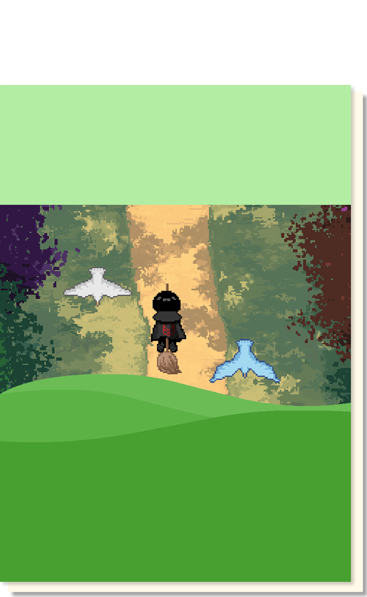

**손목 가동범위 및 유연성 개선**
- **조작법**: 손바닥 기울기로 빗자루 조종
- **목표**: 떨어지는 장애물 피하기, 아이템 획득  
- **재활 효과**: 손목 회전 운동, 미세 조정 능력 향상

**주요 게임 에셋**:

| 플레이어 | 적 캐릭터들 |
|----------|-------------|
| 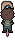 |    |

### 2. 🐱 달려라 고양이! (platformScene)
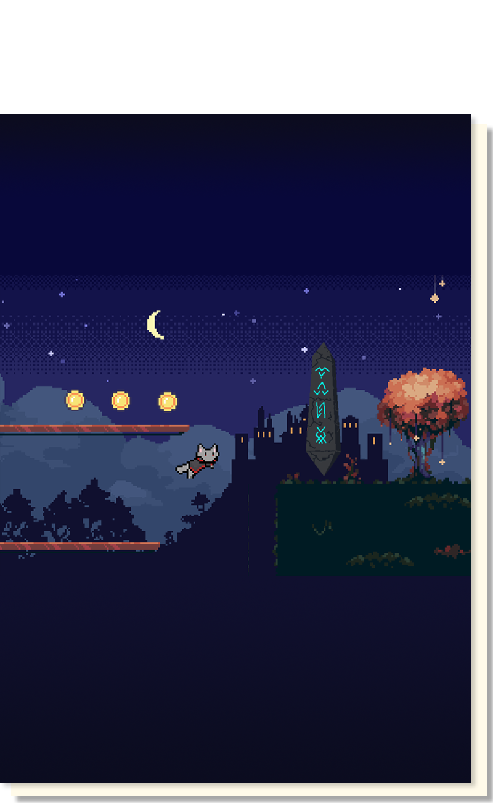

**손가락 민첩성 및 협응력 훈련**
- **조작법**: 손뒤집기(점프), 박수(방향전환), 상하운동(가속)
- **목표**: 플랫폼을 점프하며 골인지점 도달
- **재활 효과**: 손가락 독립성, 양손 협응력 개발

**주요 게임 에셋**:

| 아이템 | 환경 요소 |
|--------|-----------|
| 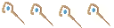  |  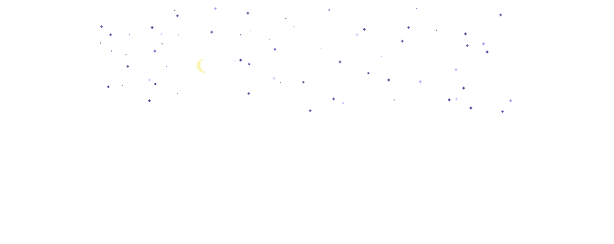 |

### 3. 🎵 울려라 오케스트라! (RhythmScene)
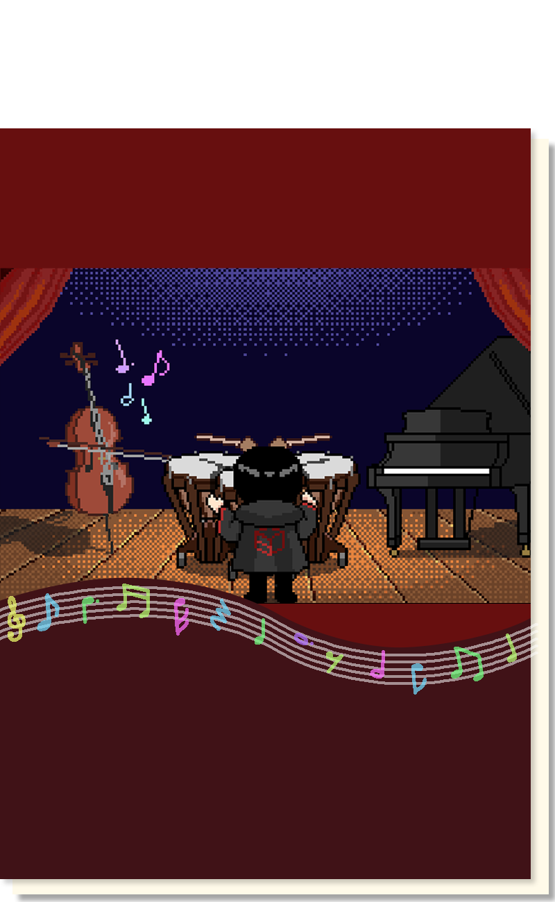

**손동작 정확성 및 반응속도 향상**
- **조작법**: 가위바위보 손동작으로 리듬 매칭
- **목표**: 떨어지는 노트에 맞춰 정확한 손동작 수행
- **재활 효과**: 손가락 개별 제어, 반응속도 개선

**주요 게임 에셋**:

| 캐릭터 | 노트 타입들 |
|--------|-------------|
| 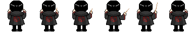 |    |

### 4. 🖊️ 그려라 마법진! (test)
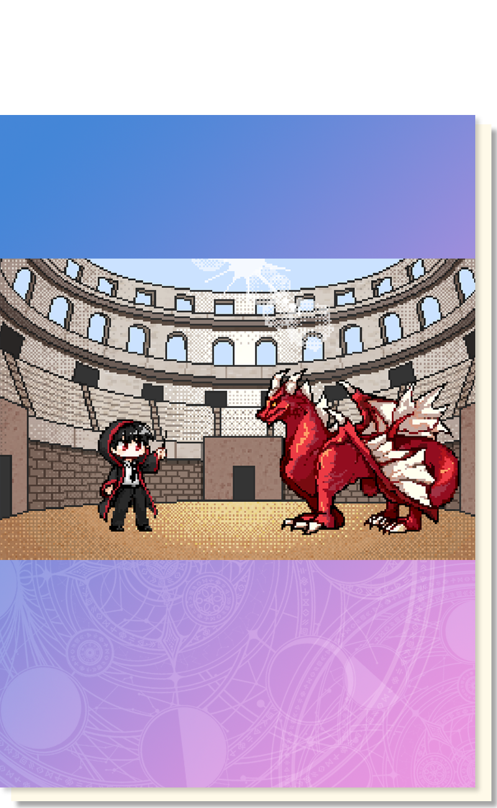

**정밀한 손동작 제어 및 집중력 향상**
- **조작법**: 손 위치로 커서 조종하여 도형 그리기
- **목표**: 주어진 도형(원, 사각형, 별)을 정확히 따라 그리기
- **재활 효과**: 정밀 운동 제어, 손-눈 협응력 강화

**주요 게임 에셋**:

| 캐릭터 | 그리기 도형들 |
|--------|---------------|
|  |    |

### 5. 🥕 뽑아라 마법채소! (ClawMachineScenes)
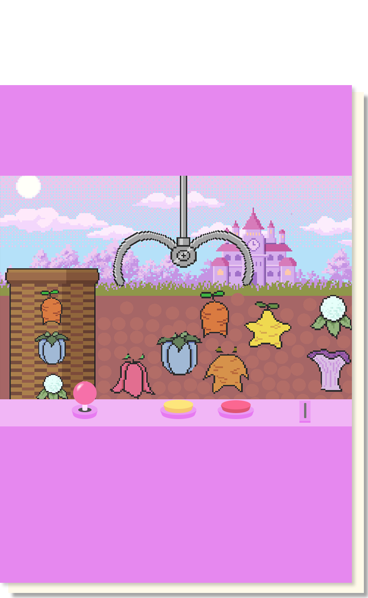

**손 쥐기 힘 조절 및 3차원 공간 인식**
- **조작법**: 손바닥 기울기(이동) + 주먹 쥐기(집기)
- **목표**: 클로우를 조종하여 채소 뽑기
- **재활 효과**: 쥐기 힘 조절, 3차원 공간 감각 개발

**주요 게임 에셋**:

| 채소 아이템들 |
|---------------|
| 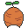 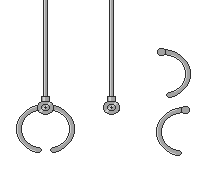 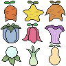 |

---

## 🛠️ 기술 스택

### 개발 환경
- **Unity**: 2022.3.x LTS
- **C#**: .NET Framework 4.8
- **LeapMotion SDK**: Ultraleap Tracking 5.2+

### 주요 라이브러리
- **Leap Motion Unity SDK**: 손동작 추적
- **EasyTransitions**: 씬 전환 효과
- **TextMeshPro**: UI 텍스트 렌더링
- **Unity Audio**: 사운드 시스템

### 플랫폼 지원
- **Windows**: DirectX 11/12
- **macOS**: Metal API
- **개발 권장 사양**: 
  - LeapMotion Controller 연결
  - Unity 2022.3.x 이상
  - RAM 8GB 이상

---

## 📁 프로젝트 구조

```
LeafTale/
├── Assets/
│   ├── BroomStickMap/          # 빗자루 게임
│   │   ├── Script/Broom/       # 플레이어 조작 스크립트
│   │   ├── Animation/          # 애니메이션 컨트롤러
│   │   └── Resource/           # 게임 리소스
│   ├── PlatFromMap/            # 플랫폼 게임
│   │   ├── Script/             # 고양이 이동, 점프 로직
│   │   └── Resource/           # 스프라이트, 사운드
│   ├── RhythmMap/              # 리듬 게임
│   │   ├── Script/Check/       # 손동작 인식 로직
│   │   └── Animation/          # UI 애니메이션
│   ├── test/                   # 드로잉 게임
│   │   ├── script/             # 그리기 및 정확도 계산
│   │   └── Resource/           # UI 리소스
│   ├── ClawMachineMap/         # 클로우 게임
│   │   ├── Script/             # 클로우 제어 로직
│   │   └── Resource/           # 3D 모델, 텍스처
│   ├── EasyTransitions/        # 씬 전환 시스템
│   ├── Sound/                  # 게임별 사운드 파일
│   ├── UI/                     # 공통 UI 컴포넌트
│   └── Scenes/                 # 게임 씬 파일들
├── ProjectSettings/            # Unity 프로젝트 설정
└── Packages/                   # 패키지 매니페스트
```

---

## 🎯 LeapMotion 손동작 인식

### 지원하는 손동작
| 손동작 | 인식 방법 | 사용 게임 | 설명 |
|--------|-----------|-----------|------|
| **손바닥 기울기** | `hand.PalmNormal` 벡터 분석 | 빗자루, 클로우 | 손바닥을 좌우/상하로 기울여 조종 |
| **주먹 쥐기** | `hand.GrabStrength > 0.9f` | 클로우, 리듬 | 손을 꽉 쥐어 물건 잡기/주먹 인식 |
| **손가락 펴기** | `finger.IsExtended` 체크 | 리듬, 드로잉 | 개별 손가락 펴기 상태 감지 |
| **검지 포인팅** | 검지만 펴진 상태 감지 | 빗자루 시작 | 검지만 펴고 나머지는 구부린 상태 |
| **박수** | 양손 거리 변화 감지 | 플랫폼 | 두 손을 마주쳐 박수치는 동작 |
| **손뒤집기** | 손바닥 방향 변화 감지 | 플랫폼 | 손바닥을 뒤집는 회전 동작 |

### 주요 인식 코드 예시
```csharp
// 손바닥 기울기 감지 (빗자루 게임)
void DetectHandTilt(Hand hand) {
    Vector3 palmNormal = hand.PalmNormal;
    
    if (palmNormal.x > 0.3f) {
        // 오른쪽으로 기울임
        moveDirection.x = palmNormal.x;
    }
    
    if (palmNormal.z < -0.3f) {
        // 아래로 기울임
        moveDirection.y = palmNormal.z;
    }
}

// 주먹 감지 (클로우 게임)
bool IsFist(Hand hand) {
    return hand.GrabStrength > 0.9f;
}

// 가위바위보 감지 (리듬 게임)
void DetectHandPose(Hand hand) {
    if (IsFist(hand)) {
        currentPose = "ROCK";
    } else if (IsScissors(hand)) {
        currentPose = "SCISSOR";
    } else if (IsPaper(hand)) {
        currentPose = "PAPER";
    }
}
```

---

## 🎨 게임별 상세 기능

### 🧙‍♂️ 날아라 빗자루!
**파일**: `Assets/BroomStickMap/Script/Broom/broomMove.cs`

**핵심 기능**:
- 검지 포인팅으로 게임 시작 (3초 홀드)
- 손바닥 기울기로 8방향 이동
- 충돌 시 스핀 효과 및 무적 시간
- 타이머 아이템으로 시간 연장

**재활 효과**:
- 손목 관절 가동범위 개선
- 미세한 손 조정 능력 향상
- 지속적인 손목 운동

### 🐱 달려라 고양이!
**파일**: `Assets/PlatFromMap/Script/catMove.cs`

**핵심 기능**:
- 손뒤집기 감지로 점프 (손바닥 방향 변화)
- 박수 감지로 방향 전환 (양손 거리 측정)
- 상하 운동으로 가속 (R-T 키 패턴)
- 플랫폼 점프 액션

**재활 효과**:
- 양손 협응력 개발
- 손가락 독립성 향상
- 동적 손동작 훈련

### 🎵 울려라 오케스트라!
**파일**: `Assets/RhythmMap/Script/Check/LeapMotionController.cs`

**핵심 기능**:
- 실시간 가위바위보 인식
- 좌우 손 독립 인식
- 리듬에 맞춘 정확도 측정
- 음악과 동기화된 노트 시스템

**재활 효과**:
- 손가락 개별 제어 능력
- 반응속도 및 정확성 향상
- 리듬감과 협응력 개발

### 🖊️ 그려라 마법진!
**파일**: `Assets/test/script/DrawingGame.cs`

**핵심 기능**:
- 손 위치로 커서 제어
- 실시간 그리기 궤적 추적
- 정확도 계산 알고리즘
- 다양한 도형 템플릿

**재활 효과**:
- 정밀한 손 제어 능력
- 손-눈 협응력 강화
- 집중력 및 인내심 개발

### 🥕 뽑아라 마법채소!
**파일**: `Assets/ClawMachineMap/Script/clawControl.cs`

**핵심 기능**:
- 손바닥 기울기로 클로우 이동
- 주먹 쥐기로 클로우 개폐
- 3D 공간에서의 정밀 제어
- 물리 기반 아이템 상호작용

**재활 효과**:
- 쥐기 힘 조절 능력
- 3차원 공간 감각
- 손목과 손가락 종합 운동

---

## 📊 데이터 수집 및 분석

### 수집되는 데이터
- **게임별 플레이 시간**: 각 게임의 세션 길이
- **정확도 점수**: 동작 인식 정확도
- **반응 속도**: 자극-반응 시간 측정
- **진행도**: 게임별 달성 레벨
- **손동작 빈도**: 특정 동작의 수행 횟수

### 데이터 전송
게임 데이터는 백엔드 API를 통해 실시간으로 전송되어 웹 대시보드에서 분석됩니다.

---

## 👥 개발팀

| 역할 | 이름 | GitHub | 담당 업무 |
|------|------|--------|-----------|
| **팀장/개발기획** | 김인성 | [@danto7632](https://github.com/danto7632) | 전체 기획, 시스템 설계 |
| **LeapMotion 개발** | 심기준 | [@potato1028](https://github.com/potato1028) | 핸드 트래킹, 동작 인식 |
| **게임 디자인** | 서윤정 | [@SeoYunJoung](https://github.com/SeoYunJoung) | UI/UX, 게임 밸런싱 |
| **게임 디자인** | 김민지 | [@dalsaemi](https://github.com/dalsaemi) | 아트 리소스, 애니메이션 |

---

## 📈 향후 계획

- [ ] **추가 게임 모드**: 새로운 재활 게임 개발
- [ ] **AI 기반 개인화**: 사용자별 맞춤 난이도 조절
- [ ] **VR 지원**: Meta Quest, HTC Vive 플랫폼 확장
- [ ] **다국어 지원**: 영어, 일본어 등 다국어 UI
- [ ] **클라우드 동기화**: 진행도 클라우드 저장
- [ ] **멀티플레이어**: 협동 재활 게임 모드

---

**🖐 건강한 손, 즐거운 재활 - LeafTale과 함께하세요!**